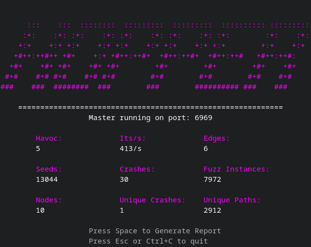
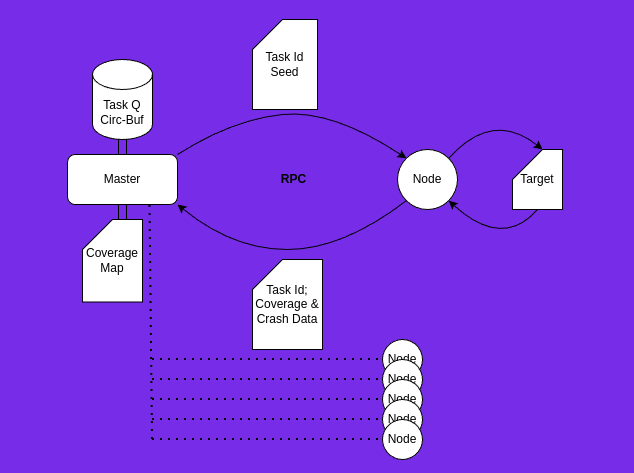
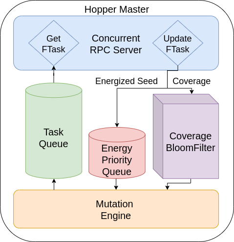
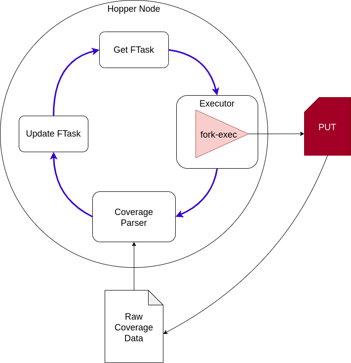

<h1 align="center">Hopper</h1>

<h3>
Distributed Fuzzer

inspired
by <a href="https://github.com/AFLplusplus/AFLplusplus">AFL++</a>
</h3>

<h4> Hopper aims to improve performance of Fuzzing in large-scale
distributed environments, it's not meant to replace AFL++ in most cases.
</h4>

 

*Hopper Master*

<a href="https://www.flux.utah.edu/paper/lremes-thesis" target="_blank">Published Paper</a>

## Usage

#### Pre-Reqs:

- [LLVM](https://clang.llvm.org/) toolchain, specifically
  [clang](https://clang.llvm.org/get_started.html) with it's built-in
  [ASAN](https://clang.llvm.org/docs/AddressSanitizer.html)
- [clang-tools](https://clang.llvm.org/docs/ClangTools.html),
  [SanitizerCoverage](https://clang.llvm.org/docs/SanitizerCoverage.html)
  sancov utility.

#### Instrumentation:

- The [compile](test/compile) script adds all the flags required to compile
  the target program with clang++.

Ex:
> `./compile target.c`

#### Env:
- `HOPPER_OUT`: Where to save Hopper output; sanitizer reports, crash inputs and
  hopper reports, defaults to `.`
- `HOPPER_LOG`: Enable Logging on Master, defaults to `HOPPER_LOG=0` _Master
  only_
- `HOPPER_LOG_INTERVAL`: Logging interval in minutes, defaults to 
  `HOPPER_LOG_INTERVAL=30` (ignored if `HOPPER_LOG` is not set) _Master only_

#### Master:

- <kbd>-I</kbd>: Path to input corpus, directory containing files each being a
  seed
- <kbd>-H</kbd>: Havoc level to use in mutator, defaults to `1` (recommended:
  increase havoc for larger seeds)
- <kbd>-P</kbd>: Port to host Master on, defaults to `6969`

Ex:
> `go build ./cmd/hopper-master && ./hopper-master -H 5 -I test/in`

#### Node:

- <kbd>-I</kbd>: Node ID, usually just a unique int
- <kbd>-T</kbd>: Path to instrumented target binary
- <kbd>-M</kbd>: IP/address of Master, defaults to `localhost`
- <kbd>-P</kbd>: Port of Master, defaults to `6969`
- <kbd>--raw</kbd>: Should seed be fed directly in the run command, defaults to
  `false`. Hopper will put bytes in a file and feed that file to target.
- <kbd>--args</kbd>: Args to use against target, ex: `--depth=1 @@`
- <kbd>--env</kbd>: Env variables for target seperated by a `;`, ex:
  `ENV1=foo;ENV2=bar;`
- <kbd>--stdin</kbd>: Should seed be fed as stdin or as an argument, defaults
  to `false`

Ex: 
> Args: `go build ./cmd/hopper-node; ./hopper-node -I 1 -T target --args "--depth=2 @@"` 
>
> Stdin: `go build ./cmd/hopper-node; ./hopper-node -I 1 -T target --stdin`

## Containerized Demos:

*You can also look at all the Hopper containers running by doing:* `docker ps -f "name=hopper"`

### Fuzzing simple parse util:

Hopper running locally with 10 fuzzing Nodes, fuzzing a test application with a known
vulnerability:

1. Clone project: `git clone https://github.com/Cybergenik/hopper.git && cd hopper`
2. Build base Hopper image: `docker build -t hopper-node .`
3. Run Master: `cd ./examples/parse && ./docker/master_docker.sh` 
4. Run Nodes: `cd ./examples/parse && ./docker/node_docker.sh 1 10` (I'd recommend no more
   than 1x # of logical cores on your machine, any more nodes on one system
   and they just get throttled and competing for CPU time)
5. Look at the nice TUI :>

### Fuzzing Readelf:

Hopper running locally with 10 fuzzing Nodes, fuzzing GNU `binutils-2.40 readelf`:

1. Clone hopper: `git clone https://github.com/Cybergenik/hopper.git && cd hopper`
2. Build base Hopper image: `docker build -t hopper-node .`
3. Build readelf image: `cd ./examples/binutils/ && docker build -t hopper-readelf .`
4. Run Master: `./readelf/master_docker.sh` 
5. Run Nodes: `./readelf/node_docker.sh 1 10` (I'd recommend no more
   than 1x # of logical cores on your machine, any more nodes on one system
   and they just get throttled and competing for CPU time)
6. Look at the nice TUI :>

### Fuzzing jq:

Hopper jq [example](./examples/jq/README.md)

## Design & Implementation

### Overview

 

### Master

The Masters job is to schedule fuzz tasks on Nodes in the cluster, keep track of
coverage, mutate seeds, and produce reports. The Master handles all these
responsibilities concurrently. There are two main processes running concurrently
on the Master, an RPC server and the Mutation Engine.

 

##### Coverage: 

Hopper uses a [bloom filter](https://en.wikipedia.org/wiki/Bloom_filter) to keep
track of coverage and to deduplicate seeds based on coverage and content.

##### Mutation Engine:

The mutation engine acts as a load balancer by popping energized seeds from the
energy priority queue (EPQ), mutating them, and feeding newly formed seeds to
the task queue. The Mutation Engine only mutates when there’s enough space in
the Task Queue for more tasks, otherwise it stalls. Because a single energized
seed can turn into tens of seeds, this can be seen as an inverse funnel, thus
the Mutation Engine has some control of flow through the system.

### Node

A Hopper Node’s job is to run the PUT, gather and parse coverage, and report
coverage/crash data to the Master. Each Node runs a main Fuzz loop. Nodes are
fairly synchronous, with a few sections of parallelism for logging crashes and
clean-up. But generally we keep each instantiation of a Node synchronous such
that we can more easily reason about it as a discrete unit of computation.

 

