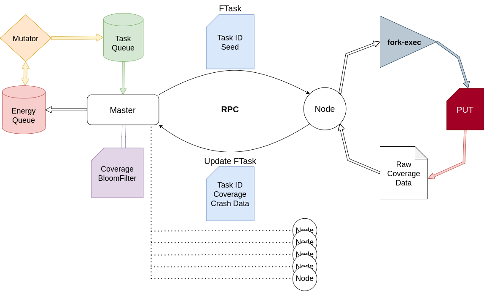

<h1 align="center">Hopper</h1>

<h3>
Coverage-Guided Greybox Distributed Fuzzer inspired
by <a href="https://github.com/AFLplusplus/AFLplusplus">AFL++</a>
</h3>

<h4> Hopper aims to improve performance of Fuzzing in large-scale
distributed environments, it's not meant to replace AFL++ in most cases.
</h4>

 

*Hopper Master*

## Usage

#### Pre-Reqs:

- [LLVM](https://clang.llvm.org/) toolchain, specifically
  [clang](https://clang.llvm.org/get_started.html) with it's built-in
  [ASAN](https://clang.llvm.org/docs/AddressSanitizer.html)
- [clang-tools](https://clang.llvm.org/docs/ClangTools.html), specifically the
  [SanitizerCoverage](https://clang.llvm.org/docs/SanitizerCoverage.html)
  sancov utility.

#### Instrumentation:

- The [compile](test/compile) script adds all the flags required to compiler
  the target program with clang++.

Ex:
> `./compile target.c`

#### Master:

- <kbd>-I</kbd>: Path to input corpus, directory containing files each being a
  seed
- <kbd>-H</kbd>: Havoc level to use in mutator, defaults to `1` (recommended:
  1-10, for builtin mutator)
- <kbd>-P</kbd>: Port to host Master on, defaults to `6969`

Ex:
> `go build . && ./hopper -H 5 -I test/in`

#### Node:

- <kbd>-I</kbd>: Node ID, usually just a unique int
- <kbd>-T</kbd>: Path to instrumented target binary
- <kbd>-M</kbd>: IP/address of Master, defaults to `localhost`
- <kbd>-P</kbd>: Port of Master, defaults to `6969`
- <kbd>--args</kbd>: Args to use against target, ex: `--depth=1 @@`
- <kbd>--env</kbd>: Env variables for target seperated by a `;`, ex:
  `ENV1=foo;ENV2=bar;`
- <kbd>--stdin</kbd>: Should seed be fed as stdin or as an argument, defaults
  to `false`

Ex: 
> Args: `cd node; go build .; ./node -I 1 -T target --args "--depth=2 @@"` 
>
> Stdin: `cd node; go build .; ./node -I 1 -T target --stdin`

## Simple Dockerized Demo:

If you want to run Hopper locally with 10 fuzzing Nodes on a test application
with a known vulnerability you can do the following:

1. Clone project: `git clone https://github.com/Cybergenik/hopper.git && cd hopper`
2. Build Image: `docker build -t hopper-node .`
3. Run Master: `./examples/run_master_docker.sh` 
4. Run Nodes: `./examples/run_node_docker.sh 1 10` (I'd recommend no more than 1.5x # of logical cores on your machine, any more
nodes on one system and they just get throttled and competing for CPU time)
5. Look at the nice TUI :>

*You can also look at all the docker images running by doing:* `docker ps`

## Architecture

 

